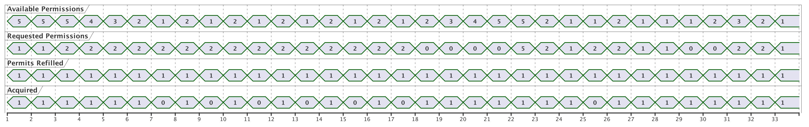
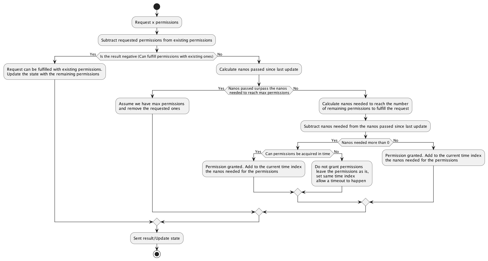

# refill-rate-limiter
Rate limiting is used to control the rate of requests sent to a software component.
By using rate limiting a service can be protected by a burst of requests whether they are of an attack nature, or some malfunctioning piece of code.

## Introduction

The `refill-rate-limiter` is a Rate Limiter implementation compatible with the rate limiter interface from [Ressilien4j](https://resilience4j.readme.io/docs/ratelimiter).
The interface functionalities the registry as well as the configuration are supported.
What it differs from the existing rate limiter implementations is that the refill-rate-limiter has a gradual request replenish thus the name refill.
Essentially it acts as a Token Bucket algorithm.

## Permission acquisition

The main concept is to have a bucket of permissions allocated with a max number of permissions,
more permissions than that number, cannot be accumulated or served.
The permissions are released per request over time
Since the Resilience4j is based on cycles to refill permissions. Cycles are used also for this implementation too.
Permissions per cycle are defined. Based on the permissions per cycle a rate of permissions per nanos is calculated.
Based on the nanos passed permissions are refilled.
Permissions are released per requests.
As nanos pass, permissions are filled based on the permissions per nanos ratio.
Provided the max number of permissions is reached, permissions accumulated are ignored.

## Internals

An integer keeps track of the permissions accumulated over time but the max value is limited 
by the max capacity. 
Another integer acts as a time index - It represents the last time we had to calculate any permissions.
At startup permissions can be pre-assigned.

Instead of eagerly calculating the permissions accumulated in intervals within the cycle, the permissions accumulated are calculated lazily when needed.

When a permission is requested the first step is to subtract the existing permissions from the request ones
If the result is positive the request can be served immediately with the permissions we already have
and the state will be updated with the remaining permissions (the result of the previous calculation).

If the result is negative, we need to see if enough time has passed to fulfil those requests.

We calculate the difference of the current Nanos minus the nanos the state we had back when we last updated (time index).
The time that has passed is caped by the time needed to fill up the maximum number of requests. 
So no matter how much time has passed we shall be limited by the max permissions, there will not be an overflow or extra permissions given.
If we are on a max permission scenario (we have accumulated the maximum of permissions), 
we remove the extra permits needed from the max permissions and we update the state 
with the permissions left and set the current nano time to the time index.
If we have not accumulated the max permissions, we check If the time we have accumulated is bigger or equal to the time needed to serve the extra requests.
If the right time has been accumulated we fulfil the request and the time index is updated with 0 permissions 
and add to the time-index the time that was needed to accumulate the permissions.
If the time needed is exceeds the accumulated time then we extract the difference and this is 
the time to wait for the permissions to be released. 
The state will have 0 permissions and the time index will be at the future. 
It will be the current index plus the time needed as a whole to fulfil the extra permissions.
If the time needed will cause a timeout no change to the state will happen.

